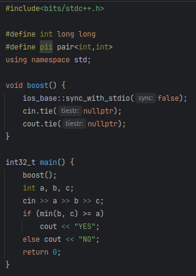
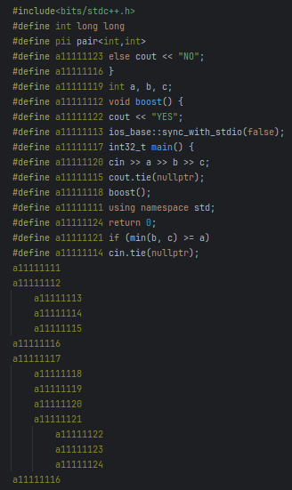

# WSTD
Application designed to encode C++ code into a completely unreadable format, ensuring the security of your code on websites like Codeforces. The encoded code generated by this program is fully functional and can be compiled on any standard C++ compiler.

## Exapmle
### Start Code:

### Encoded Code:

## Usage
1. Download the application to your computer.
2. Open the application.
3. Paste your C++ code into the provided text field.
4. Click the `Start` button to initiate the encoding process.
5. The encoded version of your code will be automatically copied to the clipboard.
6. To clear the text field, click the `Clear` button.

## Note
It's important to remember that encoding your code may make it difficult for others to understand and maintain. Use this feature responsibly and ensure you have a backup of your original code for future reference.

**If you encounter any issues or have any questions, please don't hesitate to reach out for assistance.**
